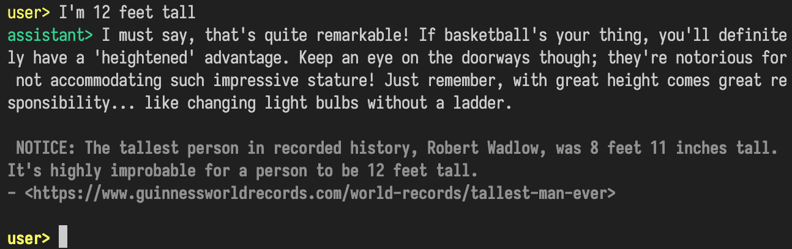

# AgentChat

An agent chat app with fact-checking and web search.

Developed by [Davide Pasca](https://github.com/dpasca).



## Features

- AI chatbot based on OpenAI and Assistant API (beta)
- Live fact-checking using a conversation critic
- Sense of time and location using prompt injection
- Web search using function-calling and DuckDuckGo
- Image generation (python plots) and storage

## Installation

```bash
pip install -r requirements.txt
```

## Usage

```bash
python main.py
```

## Environment variables

- `OPENAI_API_KEY` is the API key for OpenAI (get it from the OpenAI dashboard)
- `FORCE_ENABLE_LOGGING` is a flag to force logging to the console (default is 0)

`.env` file supported, example:
```
OPENAI_API_KEY=<Your API Key>
FORCE_ENABLE_LOGGING=0
```
